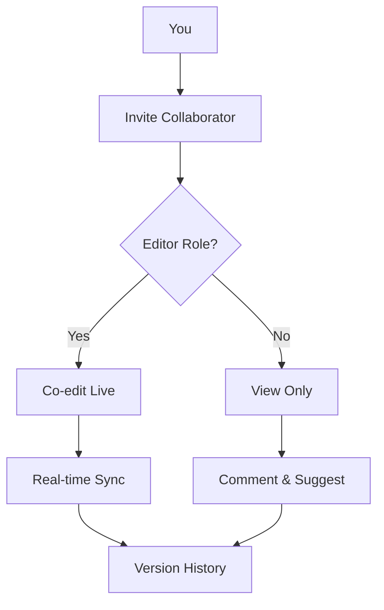

## Overview

Evgeny Tkachenko provides powerful tools to streamline your documentation workflow. You can organize content hierarchically, track changes with version history, search efficiently, and collaborate seamlessly with teams. These features help you maintain up-to-date, accessible documentation for any project.

<Columns cols={2}>
  <Card title="Document Hierarchy" icon="folder" href="#document-organization">
    Structure your docs like a file system with nested folders and pages.
  </Card>
  <Card title="Version Control" icon="git-branch" href="#version-control">
    Track edits, revert changes, and view full history effortlessly.
  </Card>
  <Card title="Search Tools" icon="search" href="#search-filtering">
    Find content quickly with advanced search and filters.
  </Card>
  <Card title="Collaboration" icon="users" href="#collaboration">
    Share, comment, and co-edit docs with permissions.
  </Card>
</Columns>

## Document Organization and Hierarchy

Build a clear structure for your documentation using folders and subpages. You create nested hierarchies to mirror your project's architecture, making navigation intuitive.

<Steps>
  <Step title="Create Folders" icon="folder-plus">
    Start by adding top-level folders for major sections like "API Reference" or "User Guides".

    ```bash
    # Example CLI command (if using integrations)
    docs create-folder "API Reference"
    ```
  </Step>
  <Step title="Add Pages" icon="file-plus">
    Nest pages under folders. Use drag-and-drop for reorganization.
  </Step>
  <Step title="Publish Hierarchy" icon="globe">
    Your sidebar automatically reflects the structure for easy browsing.
  </Step>
</Steps>

<Callout kind="tip">
  Use consistent naming conventions like "v1.0-api" for versions within folders.
</Callout>

## Version Control and History Tracking

Every edit creates a versioned snapshot. You review changes, compare diffs, and restore previous states without losing work.

<CodeGroup tabs="Web UI,CLI">
  ```javascript
  // View history via API
  const history = await fetch('https://api.example.com/docs/{docId}/history');
  console.log(history.entries);
  ```
  ```bash
  # CLI history command
  docs history --doc-id your-doc-id --limit 10
  ```
</CodeGroup>

## Search and Filtering Tools

Powerful search scans titles, content, and metadata. Filter by tags, authors, or dates to pinpoint information quickly.

<Tabs>
  <Tab title="Basic Search" icon="search">
    Enter keywords in the global search bar. Results appear instantly with previews.
  </Tab>
  <Tab title="Advanced Filters" icon="filter">
    Combine filters:

    | Filter Type | Example Usage |
    |-------------|---------------|
    | Tags       | `tag:api`    |
    | Date Range | `after:2024-01-01` |
    | Author     | `author:you` |
  </Tab>
</Tabs>

<Expandable title="Advanced Search Syntax" default-open="false">
  Use operators like `AND`, `OR`, and quotes for phrases: `"exact match" tag:internal`.
</Expandable>

## Collaboration and Sharing Options

Invite team members with role-based permissions. Share public links or embed docs externally.



<Callout kind="info">
  Set permissions at the folder level to control access hierarchically.
</Callout>

These core features form the foundation of Evgeny Tkachenko. Start with organization, then layer on collaboration for team projects. For more, explore [Quickstart](/quickstart).