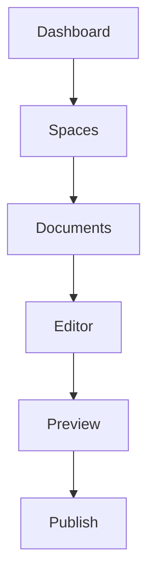

<Callout kind="info" title="Prerequisites">
Before starting, ensure you have:
- A modern web browser (Chrome, Firefox, Safari, or Edge)
- An email address for account verification
- Optional: Your `{API_KEY}` if using programmatic access later
</Callout>

## Get Started in Minutes

Follow these steps to register, create your first documentation space, and upload your initial documents. The entire process takes less than 5 minutes.

<Steps>
  <Step title="Sign Up for an Account" icon="user-plus">
    Visit the [Evgeny Tkachenko dashboard](https://dashboard.evgenytkachenko.com) and click **Sign Up**.

    Fill in your email, create a strong password, and complete the verification.

    <Callout kind="tip">
      Use a business email for team collaboration features.
    </Callout>
  </Step>

  <Step title="Log In and Create Your First Space" icon="spaces">
    After verification, log in to your new account.

    Click **New Space** in the dashboard, enter a name like "My Project Docs", and select a template (e.g., "Software Project").

    Your space is ready with a default structure including Home, API Reference, and Changelog pages.
  </Step>

  <Step title="Upload and Structure Documents" icon="upload">
    In your new space, navigate to the **Documents** section.

    Drag and drop your MDX, Markdown, or PDF files, or use the upload button.

    Use the editor to organize into folders: `/guides/quickstart.mdx`, `/api/authentication.mdx`.
  </Step>

  <Step title="Explore the Interface" icon="layout">
    Familiarize yourself with key areas:

    - **Sidebar**: Navigation to pages and spaces
    - **Editor**: Real-time MDX preview and components
    - **Publish**: One-click deployment to a custom domain

    Save changes automatically sync across devices.
  </Step>
</Steps>

## Upload Methods

Choose your preferred way to add content to your space.

<Tabs>
  <Tab title="Drag & Drop" icon="mouse">
    Simply drag files from your desktop into the Documents panel. Supports bulk uploads up to 100 files.

    Folders preserve structure automatically.
  </Tab>

  <Tab title="API Upload" icon="code">
    Use the REST API for automation.

    <CodeGroup tabs="cURL,JavaScript">
    ````bash
    curl -X POST https://api.evgenytkachenko.com/v1/spaces/{SPACE_ID}/documents \
      -H "Authorization: Bearer YOUR_API_KEY" \
      -F "file=@/path/to/quickstart.mdx"
    ````

    ````javascript
    const formData = new FormData();
    formData.append('file', fileInput.files[0]);

    fetch('https://api.evgenytkachenko.com/v1/spaces/{SPACE_ID}/documents', {
      method: 'POST',
      headers: { 'Authorization': 'Bearer YOUR_API_KEY' },
      body: formData
    });
    ````
    </CodeGroup>

    <ParamField path="SPACE_ID" param-type="string" required="true">
      Your space identifier from the dashboard settings.
    </ParamField>
  </Tab>
</Tabs>

## Basic Navigation Overview



## Next Steps

<Columns cols={3}>
  <Card title="Customize Pages" icon="edit-3" href="/introduction">
    Learn advanced MDX components and theming.
  </Card>

  <Card title="Team Collaboration" icon="users" href="/authentication">
    Invite members and set permissions.
  </Card>

  <Card title="Publish & Share" icon="globe" href="/changelog">
    Deploy to custom domains and track versions.
  </Card>
</Columns>

<Callout kind="success">
  Congratulations! Your first documentation space is live. Check the [published preview](https://docs.evgenytkachenko.com/my-project-docs) to see it in action.
</Callout>